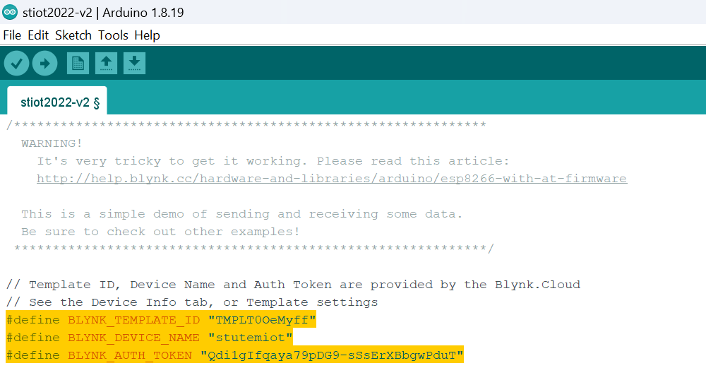

- [1. Welcome](#1-welcome)
- [2. Required Components](#2-required-components)
  - [2.1. Hardware](#21-hardware)
  - [2.2. Software](#22-software)
- [3. Overall Circuit Assembly](#3-overall-circuit-assembly)
  - [3.1. Basic power line wiring](#31-basic-power-line-wiring)
  - [3.2. LDR](#32-ldr)
  - [3.3. Soil Moisture Sensor](#33-soil-moisture-sensor)
  - [3.4. Rain Sensor](#34-rain-sensor)
  - [3.5. DHT11 Sensor](#35-dht11-sensor)
  - [3.6. ESP-01 with adapter](#36-esp-01-with-adapter)
  - [3.7. ALTERNATIVE - ESP-01 without adapter](#37-alternative---esp-01-without-adapter)
- [4. Arduino IDE Setup](#4-arduino-ide-setup)
  - [4.1. Arduino Version 2.0](#41-arduino-version-20)
    - [4.1.1. Preference Configurations](#411-preference-configurations)
    - [4.1.2. Board Manager Setup](#412-board-manager-setup)
    - [4.1.3. Library Setup](#413-library-setup)
    - [4.1.4. Load the stiot2022 sketch](#414-load-the-stiot2022-sketch)
- [5. Blynk IoT Platform Setup](#5-blynk-iot-platform-setup)
  - [5.1. Log in/Register Account](#51-log-inregister-account)
  - [5.2. Create New Template](#52-create-new-template)
  - [5.3. Add datastream](#53-add-datastream)
  - [5.4. Add Dashboard](#54-add-dashboard)
  - [5.5. Add New Device](#55-add-new-device)
  - [5.6. Copy credentials](#56-copy-credentials)
- [6. Running the project](#6-running-the-project)

# 1. Welcome
This is a github page for Program SULAM "Teknologi Mikropengawal". This page provides every stages of development process in completing the IoT system.

# 2. Required Components
## 2.1. Hardware
1. Nucleo-G031K8
2. ESP-01 (ESP8266) + Adapter Module
3. LDR
4. Rain sensor module
5. Soil moisture sensor
6. DHT11
7. 10k ohm resistor
8. Breadboard (400)
9. Jumper wires (Male-to-Female and Male-to-Male)
10. Micro-USB cable

## 2.2. Software
1. Arduino IDE (2.0+)
2. Blynk IoT Apps (access from web browser)

# 3. Overall Circuit Assembly


## 3.1. Basic power line wiring
The schematic desribe the connection for power line references regarding Vcc and GND.


## 3.2. LDR
The light diode resistor is functions to detect brighness. The resistor 10k ohm is used as the pull-down resistor.
|Sensor|Pin|Nucloe-G031K8|
|:-----|:----:|----:|
|LDR|Top|5V|
||End|A0|
|10k ohm|Top|A0|
||End|Gnd|


## 3.3. Soil Moisture Sensor
The soil moisture sensor is functions to detect the moisture level of the soil. The soil moisture content is presented in value. Higher values indicated the dryness of the soil.

|Sensor|Pin|Nucloe-G031K8|
|:-----|:----:|----:|
|Moisture Sensor|Vcc|Vcc|
||Gnd|Gnd|
||A0|A2|


## 3.4. Rain Sensor
The rain sensor is functions to detect the rain (water) existence. The rain level  is presented in value. Higher values indicated the is no rain.

|Sensor|Pin|Nucloe-G031K8|
|:-----|:----:|----:|
|Rain Sensor|Vcc|5V|
||Gnd|Gnd|
||A0|A1|


## 3.5. DHT11 Sensor
The DHT11 sensor is functions to detect the temperature and humidity of the surroundings. The temperature is presented in degree Celsius while the humidity is presented by percentage.

|Sensor|Pin|Nucloe-G031K8|
|:-----|:----:|----:|
|DHT11|Vcc|5V|
||Gnd|Gnd|
||Data|D6|


## 3.6. ESP-01 with adapter
The ESP-01 is functions to enable wifi connection to the Nucleo-G031K8. The adapter simplified the connection from 8-pin to 4-pin wiring. 
|Sensor|Pin|Nucloe-G031K8|
|:-----|:----:|----:|
|ESP-01|Vcc|5V|
||Gnd|Gnd|
||Tx|D4|
||Rx|D5|


## 3.7. ALTERNATIVE - ESP-01 without adapter
If the message "ESP not responding" received during program execution, most likely the adapter is faulty. As alternative, you need to re-wire the ESP-01 directly to the Nucleo-G031K8 board (leaving the adapter out).

|Sensor|Pin|Nucloe-G031K8|
|:-----|:----:|----:|
|ESP-01|Vcc|3V3|
||EN|3V3|
||Gnd|Gnd|
||Tx|D4|
||Rx|D5|


# 4. Arduino IDE Setup
## 4.1. Arduino Version 2.0
###  4.1.1. Preference Configurations

1. Navigate to **File > Preferences**
   
   

2. Click on the icon for **Additional Boards Manager URLs**

      

3. Type the following links into the textbox.
   
   ```
   https://github.com/stm32duino/BoardManagerFiles/raw/main/package_stmicroelectronics_index.json
   http://arduino.esp8266.com/stable/package_esp8266com_index.json
   ```

4. Press **OK**

###  4.1.2. Board Manager Setup

1.  Navigate to **Tools > Board: > Board Manager**
   
    
  
2.  Type ```stm32``` in the search box. Select "STM32 MCU based Boards" and click **Install**.
    
    
  
3. Type ```esp8266``` in the search box. Select "esp8266" and click **Install**.

    

###  4.1.3. Library Setup

1. Download the Blynk_Release_v1.1.0.zip file from [Blynk Github](https://github.com/blynkkk/blynk-library/releases/tag/v1.1.0). 
   
    

2. Extract and copy both **Libraries** and **Tools** folders.
   
3. Paste all of the folders to your _sketchbook folder_ of Arduino IDE. Navigate to **File > Preference** in Arduino IDE to find your _sketchbook folder_.
   
    

    >- **libraries** should go to **libraries** 
    >- **tools** should go to **tools** 
    >- If you don't have **libraries** or **tools** folders, you can create them manually.

4. Navigate to **Sketch > Include library > Manage Libraries**

5. In the search box, type ```dht sensor library```. Click **Install**

    

    > If there is prompt to install "Adafruit Unified Sensor", click **YES**

6. In the search box, type ```Adafruit Unified Sensor```. Click **Install**
   Skip this instruction if you already install the library in (2).

   

###  4.1.4. Load the stiot2022 sketch
Download and open the [stiot2022 sketch](./stiot2022-v2/stiot2022-v2.ino) in your PC.


# 5. Blynk IoT Platform Setup

Navigate to [Blynk Cloud](https://sgp1.blynk.cloud/dashboard/login) in your browser.

## 5.1. Log in/Register Account
Do log in to your account or register a new account if you don't have any.


The main interface of blynk.cloud

## 5.2. Create New Template
1. Click on the template icon (9-dots) on the right panel.
   
    

2. Click the "+ New Template" to create new template

    

3. Fill in the details for your new template. Click **Done** when finished.
   
   

4. The interface for your template as follows.
   
    

## 5.3. Add datastream
Datastream indicated the type and value of data that will be received by Blynk Cloud from your STM32 board.

1. From the template page, click on the **Datastream** tab.
   
   

2. Click on the **+ New Datastream** and select **Virtual Pin**.  
   
    

3. Enter the details to record your first datastream.
   
    

4. Click **Create** and return to the datastream interface.
   
    

5. Continue to add new Datastream according to the following table.
   
    
    
## 5.4. Add Dashboard

Dashboard is your main interface in monitoring all data received by Blynk Cloud.

1. Click on the **Dashboard** tab to open the dashboard interface.

    

2. Add new widget by selecting any widget in the widget box (left panel). 
3. Click and drag a widget called  **Label** to the centre page. 
4. Hover over the widget and click the cogwheel for Label settings.
   
   
  
5. Insert the details to set label for the first datastream (V2). Click **Save**.
   
    
    
6. Click and drag a widget called **Gauge** to the centre page.
   
   

7. Hover over the widget and click the cogwheel for Gauge settings.
   
   
  
    > You can also change the color of the widget to your preference.

8.  Continue adding new widgets until all of the datastreams are presented in the dashboard. An example of a complete dashboard as follows.
   
    

9.  Click **Save and Apply** at the top-right of the page.
   
## 5.5. Add New Device
Now, we need to create a new device for our template.

1. Go back to the main page by clicking the magnifier icon on the left panel.
    
    

2. Click on **+ New Device** on the top left of the page.
3. Select **From template**.
   
   

4. Fill in detail for the new device. Click **Create**.
   
    

5. Your device page will appear.
   
   

## 5.6. Copy credentials
To link your Blynk Cloud device and your STM32 board, you need to copy the Device Info or credentials and paste the info to your Arduino sketch.

1. Click on the **Device Info** tab.
   
    

2. Click on the **Firmware Configuration** to copy your code to the clipboard. Then directly switch to your Arudino IDE with the stiot2022 skecth is open.

# 6. Running the project
1. Paste the credentials in Arduino IDE at the section.
   
   

2. Change your SSID and password according to your WiFi hotspot.
   

3. Select the board ```Nucleo-32```

    

4. Select the STM32 board ``-G031K8```

    


5. Select the comm port
   
    

6. Click on the **Upload** button to program the board.
7. Once programmed, click the serial monitor (magnifier icon on the top-right) to view the serial comm.
8. Make sure ```Both NL & CR``` and ```115200 Baud``` are selected.
9. A Blynk image is appear indicating the program is running. Sample image:
    
    

10. If program not responding, press the RST button at the bottom of the STM32 board or re-program the board from Arduino IDE.


